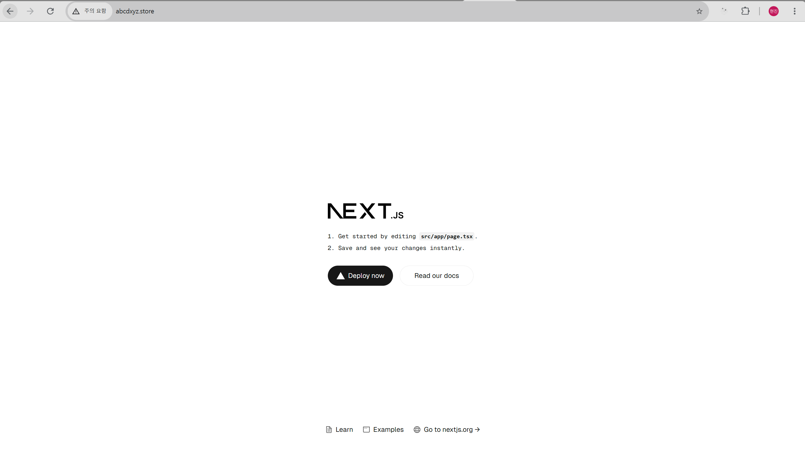
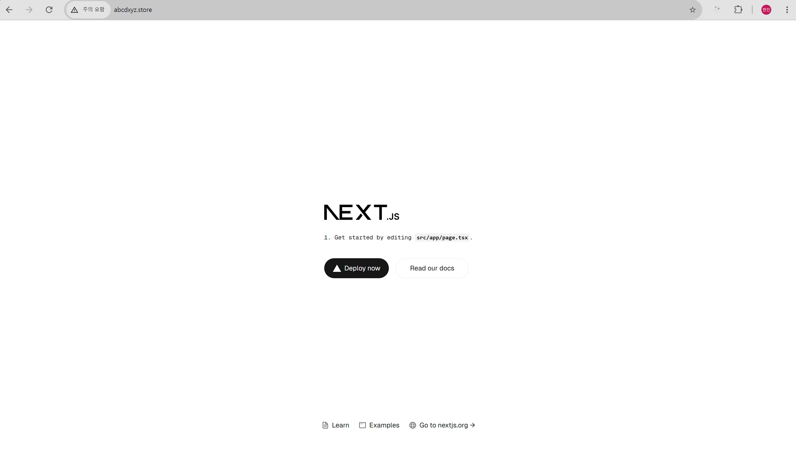

This is a [Next.js](https://nextjs.org) project bootstrapped with [`create-next-app`](https://nextjs.org/docs/app/api-reference/cli/create-next-app).

## 주요 링크

- S3 버킷 웹사이트 엔드포인트: http://abcdxyz.store.s3-website.ap-northeast-2.amazonaws.com
- CloudFront 배포 도메인 이름: d2mmmasb3m3vul.cloudfront.net
- DNS: http://abcdxyz.store/

## 배포 파이프라인

## 배포 테스트

변경된 내용이 적용되어 배포되는지 확인

<코드 변경 전>

<코드 변경 후>

