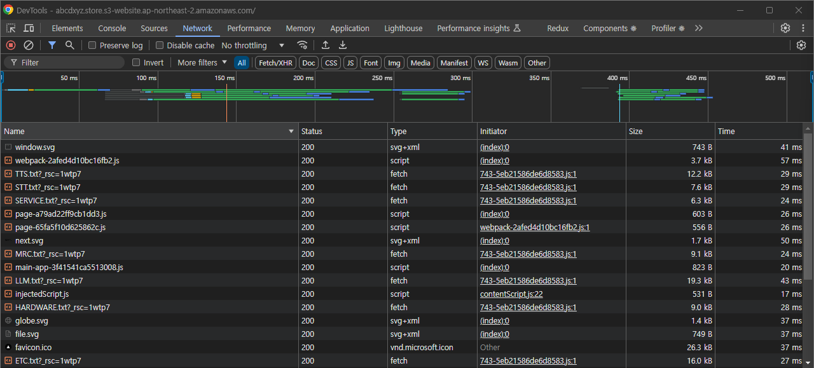
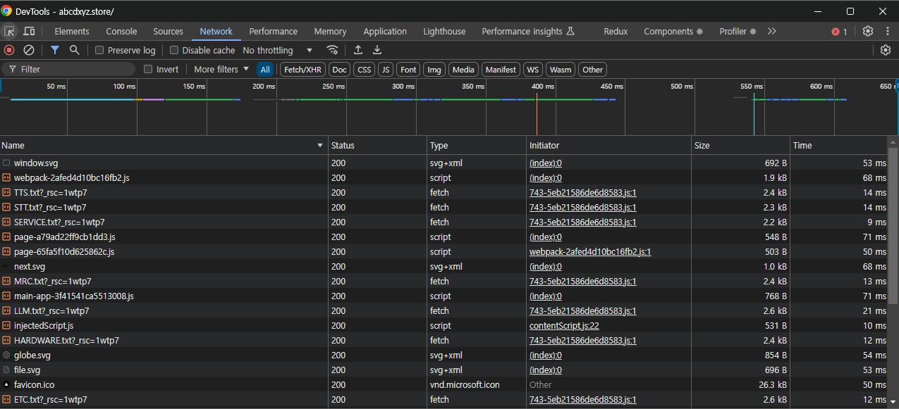

This is a [Next.js](https://nextjs.org) project bootstrapped with [`create-next-app`](https://nextjs.org/docs/app/api-reference/cli/create-next-app).

## 주요 링크

- S3 버킷 웹사이트 엔드포인트: http://abcdxyz.store.s3-website.ap-northeast-2.amazonaws.com
- CloudFront 배포 도메인 이름: d2mmmasb3m3vul.cloudfront.net
- DNS: http://abcdxyz.store/

## 배포 파이프라인

## 배포 테스트

변경된 내용이 적용되어 배포되는지 확인

<코드 변경 전>

<코드 변경 후>

## CDN 도입 전후 성능 개선 보고서

<CDN 적용 전>

<CDN 적용 후>

<내용 정리>  
시크릿 모드로 처음 페이지로 진입했을 때, 뚜렷한 성능의 차이가 보이지는 않음.  
하지만 그 이후 새로고침 시 CDN을 활용한 경우 대다수의 리소스의 status가 304로 높은 캐시 히트률을 기록.

각각의 총 5번의 새로고침 결과 비교표는 다음과 같음.  
| 지표 | S3 직접 연결 | CDN 적용 | 변화 |
|------|--------------|-----------|-------|
| 요청 수 | 27개 | 27개 | 변화없음 |
| 전송된 데이터 | 10.1 kB | 11.6 kB | +1.5 kB |
| 리소스 크기 | 674 kB | 674 kB | 변화없음 |
| 페이지 완료 시간 | 286 ms | 238 ms | -48 ms 개선 |
| DOMContentLoaded | 118 ms | 108 ms | -10 ms 개선 |
| 전체 로드 | 251 ms | 217 ms | -34 ms 개선 |

전반적인 속도 향상이 이루어졌으며, 전송된 데이터의 크기가 커진 이유로는 캐싱 및 라우팅을 위한 추가 헤더가 포함되었기 때문으로 예상함.

<결론>

1. CDN 도입 효과

- 초기 로딩에는 큰 차이가 없지만, 새로고침 시 캐시 활용으로 인한 성능 향상이 보임

2. 캐시 효율성

- 304 상태 코드를 통한 효율적인 캐시 활용이 가능

3. 반대 효과

- CDN 헤더로 인한 약간의 데이터 증가가 발생

4. 최종 의견

- CDN 도입은 전반적인 페이지 로딩 시간 단축을 일으킴
- 데이터 전송량의 증가는 미미한 수준
- CDN 도입에 대해 긍정적 의견 제시
